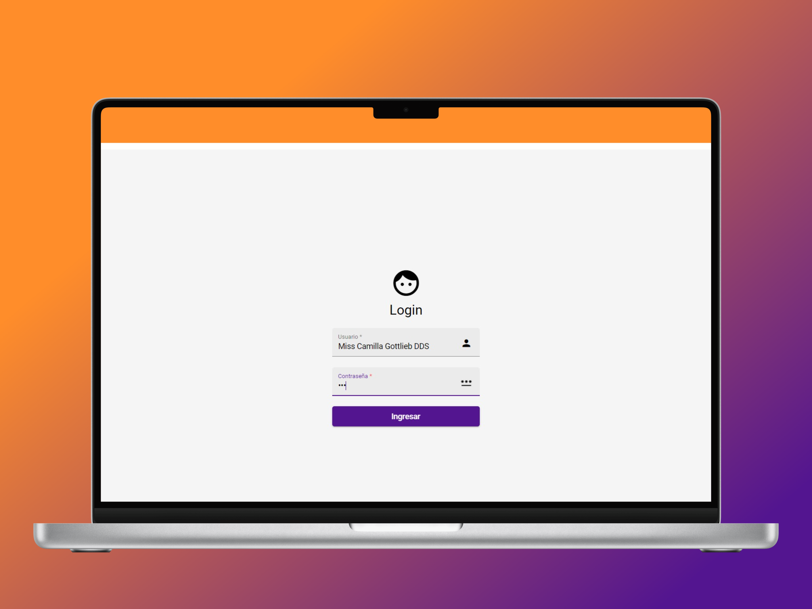

# Papeleria JIM
This  project,, is a web application designed to simplify product management and CRUD (Create, Read, Update, Delete) operations efficiently. PapeleriaJIM use a REST API hosted at [Railway](https://jim-rest-production.up.railway.app/) to interact with a database and provide a comprehensive set of tools for product administration.

## REST API REPOSITORY
[Lumen Laravel REST API](https://github.com/JoseCorreaMorales/jim-rest)

<p align="center">


</p>


## Design 🎨

<h3 style="text-align:center;">Login</h3>
<p align="center">


</p>

<h3 style="text-align:center;">Table of products</h3>
<p align="center">


</p>


### Color palette 🖌️
<p align="center">


[Live version](https://colorhunt.co/palette/541690ff4949ff8d29ffcd38)
</p>

## Components 📦

* **`Dialog`**: The Dialog component is a UI component that displays a modal dialog box. It is used to show important information to the user, prompt the user for input, or confirm an action. The Dialog component can be customized with various options such as the title, content, and buttons. It can be opened and closed programmatically using the `open()` and `close()` methods. The Dialog component is part of the Angular Material library and can be imported into an Angular project by importing the `MatDialogModule`.

* **`tableComponent`**: This Angular component, named TableComponent, is used to display a data table and perform related operations. Here's a brief description of its key parts:

* defines the columns to display in the table.
* manages data visualization using the `MatTableDataSource`, `MatSort`, and `MatPaginator` classes.
* includes functions for opening a modal dialog, applying **filters**, fetching data, editing, and deleting records.
* It displays notifications using `MatSnackBar`.

* **`LoginComponent`**: The Login component is a UI component that provides a form for users to enter their login credentials.

* **`navbarComponent`**: The provided code is an Angular component called NavbarComponent and its associated HTML template for a navigation bar. It displays user information and provides a logout button.

* **`shared`**: is responsible for configuring and exporting various Angular Material modules for use in other parts of the Angular application.


## 📝 Services
**`ApiRestService`**: This component is a service used for performing CRUD operations by consuming the REST API hosted on [Railway](https://railway.app/). It is employed in various components to fetch and manipulate data from the REST API
## Project specifications
This project was generated with [Angular CLI](https://github.com/angular/angular-cli) **version 14.1.3.**

## Install dependencies
```
npm install
```

## Fake json server commands 
        
```
json-server --watch db.json
``` 

## Development server

Run `ng serve` for a dev server. Navigate to `http://localhost:4200/`. The application will automatically reload if you change any of the source files.

## Code scaffolding

Run `ng generate component component-name` to generate a new component. You can also use `ng generate directive|pipe|service|class|guard|interface|enum|module`.

## Build

Run `ng build` to build the project. The build artifacts will be stored in the `dist/` directory.

## Running unit tests

Run `ng test` to execute the unit tests via [Karma](https://karma-runner.github.io).

## Running end-to-end tests

Run `ng e2e` to execute the end-to-end tests via a platform of your choice. To use this command, you need to first add a package that implements end-to-end testing capabilities.

## Further help

To get more help on the Angular CLI use `ng help` or go check out the [Angular CLI Overview and Command Reference](https://angular.io/cli) page.

## Resources
* [JSON Server ](https://www.npmjs.com/package/json-server)
* [Angular Material](https://material.angular.io/)
